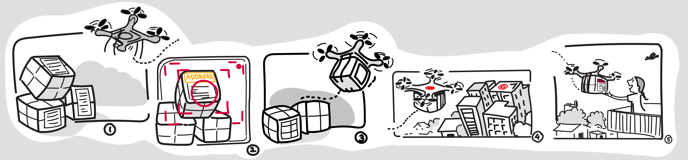

# eYRC Vitarana drone

Our submission for the e-Yantra Robotics Competition 2020-21 for theme vitarana drone. 

We used the following concepts to develop our solution:
1. Control systems (PID building).
2. Path planning & obstacle avoidance.
3. Image processing for marker detection.
4. Scheduling of the parcels to be delivered and returned. 

Tools used:
1. Robot Operating System (ROS)
2. Gazebov simulator
3. Python and its libraries

You can check out our solution's demo here: [link][demo-link]

[demo-link]:https://www.youtube.com/watch?v=YNv9PC7-EAY&t=0s